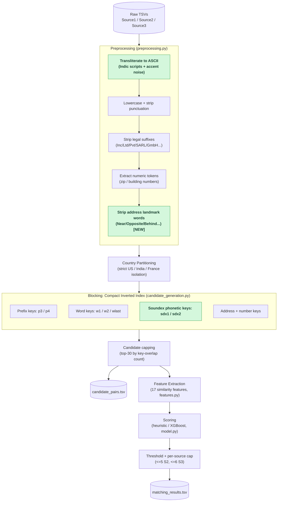
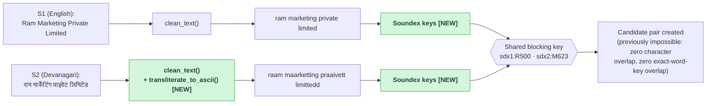
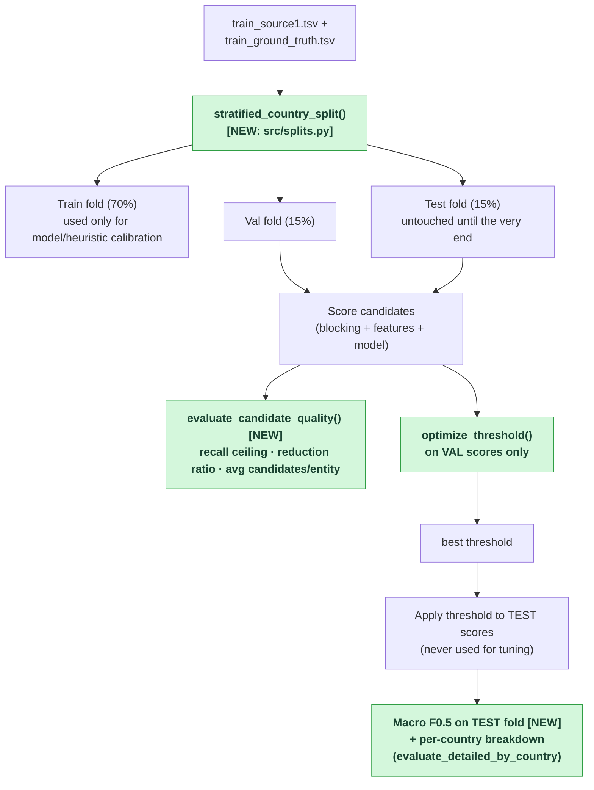

# Amazon ML Challenge 2026: Business Entity Resolution
### Team `aads`

A scalable, memory-efficient Machine Learning solution for Business Entity Resolution across noisy, independent catalog sources (Source 1 reference against Source 2 and Source 3 target pools).

Designed to process $> 11$ million multi-country records within **32 GB RAM** on an AWS SageMaker `ml.m5.2xlarge` instance without triggering the Linux OOM killer.

**Contents:** [How It Works](#how-it-works-plain-english) · [Architecture & Data Flow](#architecture--data-flow) · [Semantic Matching](#semantic-matching-embeddings) · [Key Highlights](#key-highlights--innovations) · [Roadmap](#roadmap-hardening-against-real-dataset-findings) · [Directory Structure](#directory-structure) · [Dataset Setup](#dataset-setup) · [Quickstart](#quickstart) · [Docker](#docker) · [Output Format](#output-format)

---

## How It Works (Plain English)

The task: for every business in **Source 1** (a clean, deduplicated reference list), find every record in **Source 2** and **Source 3** (two large, messy target pools) that describes the *same real-world business* — even though the three sources never share an ID, and names/addresses are full of typos, abbreviations, missing pieces, and — as we found by actually reading the data — different alphabets entirely (see [Roadmap #1](#roadmap-hardening-against-real-dataset-findings)).

The scoring metric (Macro F0.5) punishes a wrong match *twice as hard* as a missed one, and rewards correctly saying "no match" at full credit. So the whole pipeline is built around **precision first, recall second**:

1. **Clean & normalize** every name/address the same way, regardless of source (`preprocessing.py`) — lowercase, strip punctuation, expand abbreviations, remove legal suffixes (`Pvt Ltd`, `LLC`, `SARL`...), and — since real data forced this — transliterate non-Latin scripts and strip accent noise before anything else runs.
2. **Never compare across countries.** The ground truth shows 0% of matches cross a country boundary, so blocking and scoring are strictly partitioned by country — this alone rules out the vast majority of impossible pairs before any real comparison work happens.
3. **Block, don't brute-force** (`candidate_generation.py`). Comparing every Source 1 record against every Source 2/3 record is billions of comparisons — instead, an inverted index maps cheap "keys" (name prefixes, significant words, phonetic codes, address numbers) to the records that share them, so each Source 1 entity only ever gets compared against a short list of plausible candidates.
4. **Score each candidate pair** on 17 similarity features (`features.py`) — name similarity (several algorithms, on both the full name and the legal-suffix-stripped "core" name), structural signals (shared tokens, length ratios), and address similarity (word overlap, character overlap, matching numbers).
5. **Decide with a threshold, then cap per source** (`model.py`, `pipeline.py`). A candidate becomes a match only above a tuned score threshold, and even then at most 5 Source 2 matches + 6 Source 3 matches survive per entity — that specific 5/6 split come from measuring the real ground-truth cardinality distribution, not a guess.
6. **Stream results to disk** in batches, so memory use stays flat regardless of how many millions of records are being processed.

Everything below this point is either the detailed technical view of that same pipeline (diagrams), or a running log of specific bugs we found by reading the *actual* competition data and what we did about each one (roadmap table).

---

## Architecture & Data Flow

### End-to-end pipeline (new nodes highlighted in green)



### What the cross-script fix actually does, on a real row pair

This is the literal S1 (English) vs. S2 (Devanagari) pair pulled from `train_source2.tsv`, run through the *actual* edited code:



Before this fix, `w1:ram` vs. `w1:raam` and every prefix/exact key differed by spelling, so this pair never became a candidate at all — it was invisible to blocking, not just weakly scored.

### Evaluation harness: why the old 0.88–0.99 range wasn't trustworthy



Previously, the threshold sweep and the reported F0.5 both ran against the *same* set of S1 entities (or whatever `--subset` happened to be that run) — so the number was always at least a little optimistic, and small subsets skewed further toward 1.0 because macro F0.5 rewards correctly-predicted singletons at full credit. Now the reported number comes from a fold the threshold search never saw.

---

## Semantic Matching (Embeddings)

**Why:** a real, measured SageMaker run scored 0.616 — far below the ~0.88 the local heuristic-tuning suggested — and the single largest known gap is the cross-script problem in [Roadmap #1](#roadmap-hardening-against-real-dataset-findings): transliteration + Soundex narrow it, but every one of the 17 lexical features still operates on literal characters, so they structurally cannot fully close a gap between two genuinely different alphabets. A sentence-embedding model trained to place semantically equivalent names close together *regardless of script* attacks that gap directly.

**Model:** [`Graphlet-AI/eridu`](https://huggingface.co/Graphlet-AI/eridu), Apache-2.0 licensed, ~118M parameters (well under the competition's 8B limit) — created by Russell Jurney / Graphlet AI with the OpenSanctions community. It's a fine-tune of `sentence-transformers/paraphrase-multilingual-MiniLM-L12-v2`, trained with contrastive learning on 2M+ labeled matching/non-matching person and company name pairs specifically for cross-language, cross-script name matching. Chosen over generic multilingual embedding models (e5, LaBSE) because it's fine-tuned for exactly this task. Candidate retrieval over embeddings at real dataset scale uses [FAISS](https://github.com/facebookresearch/faiss) (`faiss-cpu`, MIT licensed) rather than a brute-force similarity matrix, which is infeasible at millions of rows.

**⚠️ Not yet verified — read before relying on this.** The model name has not been directly confirmed from this development environment: one load attempt failed with a DNS error, another **segfaulted** inside sentence-transformers' fallback model-construction path (unrelated to normal Python exception handling — see `src/embeddings.py::_hub_reachable`'s docstring), and a direct HF API check returned a confusing "Invalid username or password" on a public endpoint. None of that is clean evidence the model doesn't exist — independent web search results consistently named it with specific real-looking sub-paths — but it means the actual weights have never successfully loaded anywhere this was built. **Before a real run**, on SageMaker (real internet access), run this in isolation first:
```bash
python3 -c "from sentence_transformers import SentenceTransformer; SentenceTransformer('Graphlet-AI/eridu')"
```
If that fails, everything degrades gracefully (see `load_embedding_model()`) rather than crashing the pipeline — you just silently don't get the semantic-matching benefit, which is worth knowing rather than assuming.

**How it's wired in** (`--use_embeddings`, off by default so existing behavior is unchanged unless requested):
- **Blocking**: per country, target-pool names are encoded once and indexed with FAISS; each S1 batch's semantic nearest-neighbors (`--emb_top_k`, default 5) are unioned with the existing lexical/Soundex candidates (`merge_candidate_pairs`, deduped) — this is what actually surfaces a cross-script pair that shares zero characters, words, or Soundex codes.
- **Scoring**: cosine similarity between the query and candidate embedding becomes an 18th feature, `semantic_sim` — used by XGBoost when a real model is trained with `use_transformer=True`, and blended into the heuristic scorer too (reweighted, not just added on top, so the heuristic's weights still sum to 1.0) since no trained checkpoint exists yet and the heuristic is what actually runs by default.

**Known unverified cost:** encoding an entire country's target pool (millions of rows for the largest countries) through a transformer, even a small one, on CPU has not been timed at real scale — test with `--subset` first, and watch the `[embeddings]`/timing log lines before committing to a full run.

---

## Key Highlights & Innovations

1. **Compact Inverted Indexing (`np.uint32`)**:
   Stores candidate index posting lists as 32-bit unsigned integer arrays, reducing memory by over $85\%$ compared to string objects or dense matrices.
2. **High-Frequency Key Pruning**:
   Keys indexing $> 10,000$ target records (generic business stop words and common tokens) are pruned to prevent $O(N \times M)$ quadratic candidate blowups.
3. **$S1$ Batch Chunking**:
   Slices Source 1 into batches (e.g. 50,000 rows). Candidate generation, feature extraction, and model scoring execute per chunk followed by immediate `gc.collect()`.
4. **Candidate Capping**:
   Limits maximum candidates to 30 per $S1$ query record, prioritizing candidates by blocking key overlap counts.
5. **Vectorized Feature Extraction**:
   Uses direct integer array indexing with RapidFuzz for high-speed similarity calculation ($> 500\text{k}$ pairs/sec) without DataFrame merge overhead.
6. **XGBoost Classifier + Fast Heuristic Fallback**:
   Trained on ground truth positive and negative pairs to maximize macro-averaged $F_{0.5}$. Checkpoint is only 359 KB ($< 8\text{B}$ parameter constraint).
7. **Streaming TSV Output**:
   Flushes predictions incrementally to disk (`output/matching_results.tsv`), adhering strictly to the competition format.
8. **Cross-Script Transliteration + Phonetic Blocking** *(new)*:
   Converts native-script business names/addresses (Devanagari, Tamil, Telugu, Kannada, Gujarati, Bengali, Malayalam, Oriya, Gurmukhi) and accented-Latin noise to ASCII before matching, plus a Soundex phonetic blocking key so transliteration spelling variants (`private` vs. `praaivett`) still collide into the same candidate block.

---

## Roadmap: Hardening Against Real Dataset Findings

The items below come from actually reading the real `student_resource/dataset` files (not assumptions) — row counts, script/character surveys, and manual verification of each fix against real rows before merging.

| # | Issue found in real data | Status | Notes |
|---|---|---|---|
| 1 | **~40% of India's Source 2/3 pool is written in native script** (Devanagari, Tamil, Telugu, Kannada, Gujarati, Bengali, Malayalam, Oriya, Gurmukhi) while Source 1 is ~100% Latin-script — these records were previously invisible to both blocking and scoring | ✅ **Done** | `preprocessing.py` now transliterates to ASCII before cleaning; `candidate_generation.py` adds a Soundex phonetic blocking key so transliterated spelling variants still land in the same candidate block. Verified against real rows (see diagram above). |
| 2 | **~7% of US names have injected accent noise** (`Nétwork` → should be `Network`) that was never normalized (`unicodedata` was imported but unused) | ✅ **Done** | Fixed by the same transliteration step as #1 — verified on the actual noisy rows. |
| 3 | **France (test-only country) has real French accents** (`Président`) that broke suffix-stripping (`societe` never matched `société`) | ✅ **Done** | Same transliteration step handles this too — verified on the actual test-set row. |
| 4 | **Real file sizes are much larger than the docs assumed** (train alone is Source1 2.2M + Source2 5.0M + Source3 5.3M ≈ 12.5M rows; test is a similar size again) — current code loaded Source2+Source3 fully into memory with several duplicated derived text columns living far longer than needed | 🔶 Partially addressed | Three changes, each individually verified at small/measurable scale (full verification needs a real SageMaker run — the actual dataset can't be loaded on the 16GB machine this was developed on): **(a)** `country_clean` is now `pd.Categorical` instead of plain strings — measured on a 100k-row proxy at the real countries' proportions, this column alone drops ~60x (a straight-line extrapolation puts the full ~12.5M-row column at ~757MB→~13MB, though that's an estimate, not a measured full run). **(b)** The per-country target-pool text arrays (`t_clean`/`t_norm`/`t_stripped`/`t_addrs_clean`/`t_addrs_norm`/`t_nums`) previously stayed alive as loose Python lists for that country's *entire* processing, duplicating `df_target_proc`'s own copy — now freed immediately after being consumed, in both `pipeline.py`'s main loop and `_run_scoring_pipeline` (this already matched `optimize_submission.py`'s existing, better practice — pipeline.py was the inconsistent one). **(c)** New `src/memlog.py` prints real peak-RSS at each checkpoint (after loading, after each country's index build, every 5 batches), so the *next* SageMaker run produces actual measured numbers instead of more static estimates. |
| 5 | Threshold defaults disagreed across `pipeline.py` (0.80) and `optimize_submission.py` (0.62) | ✅ **Done** | Both now default to `0.62` with an explicit CLI help-text note that it's a placeholder, not a verified optimum — the real value has to come from actually running `--validate` (see #6) on SageMaker, which this environment can't do at full scale. |
| 6 | F0.5 was tuned **and** reported on the same data (no held-out split) — the 0.88–0.99 range seen so far was never a trustworthy, reproducible number | ✅ **Done** | New `src/splits.py`: stratified (by country) train/val/test split. `pipeline.py --validate` now tunes the threshold on the **val** fold only and reports Macro F0.5 on the **test** fold, which the tuning step never sees, plus a per-country breakdown (`evaluate_detailed_by_country`) so a France-specific regression can't hide behind US/India volume. Verified on a small real 3,000-row sample (zero overlap between folds, country ratios preserved, perfect-prediction sanity check = 1.0) — a full run still needs to happen on SageMaker. |
| 7 | No trained XGBoost checkpoint exists; every run currently falls back to the hand-weighted heuristic scorer | 🔲 To do | Needs an actual training run on SageMaker — can't be done on a 16GB laptop against the real 10M+ row files. |
| 8 | `candidate_pairs.tsv` size/recall-ceiling was never measured, even though the competition grades it separately from the leaderboard score | ✅ **Done** | New `evaluate_candidate_quality()` in `evaluate.py`: reports avg/median candidates per entity, total candidate pairs, and **recall ceiling** (the fraction of true matches that actually survive into the candidate set, regardless of score) — wired into `pipeline.py --validate`'s output. |
| 9 | Training sample for calibration used the first 50k S1 rows — no guarantee the raw file isn't grouped by country | ✅ **Done** | New `stratified_sample()` in `src/splits.py`, wired into both `pipeline.py::train_or_load_model` and `optimize_submission.py --train`. Verified on a deliberately US-heavy-first real slice (2000 US then 500 India rows): the old `df.iloc[:200]` gave **100% US, 0% India**; the new sampler gives **160:40 (4:1)**, matching the true population ratio. |
| 10 | Address "landmark" filler words (`Near`, `Opposite`, `Behind`, ...) weren't filtered out of address blocking/features | ✅ **Done** | Verified real frequency first (`near` in ~5.5% of India addresses, `opposite` in ~3.4%, plus `behind`/`beside`/`backside`/`above`/`below`/`front`/`infront`/`landmark`). New `ADDRESS_LANDMARK_WORDS` + `strip_landmark_words()` in `preprocessing.py`, applied to `business_address_norm` (fixes `features.py`'s address similarity) and directly inside `candidate_generation.py::extract_keys` (fixes blocking's `aw1`/`aw2` keys). Verified on a real address: blocking's `aw1` key shifted from the near-useless `near` to the actually-specific `1106` (a building number). |

**Status: 8/10 done, 1 partial.** Remaining: #4 needs a real SageMaker run to confirm the estimated memory savings actually hold at full scale, and #7 needs a real SageMaker training run — neither is something that can be faked or fully verified on a 16GB laptop against a ~24M-row dataset.

---

## Directory Structure
```
AmazonMLC/
├── README.md                                          # Project root documentation
├── Dockerfile                                         # Portable runtime image (see Docker section)
├── .dockerignore                                      # Keeps dataset/output/models out of the build context
├── optimize_submission.py                             # Standalone post-processing / rescoring script
├── models/
│   └── entity_model.json                              # Trained XGBoost model checkpoint (mounted, not baked in)
├── aads_submission/
│   ├── Documentation_template.md                      # Official challenge documentation
│   └── business_entity_resolution/
│       └── code/
│           ├── README.md                              # Code guide
│           ├── requirements.txt                       # Core Python dependencies (installed by default)
│           ├── requirements-optional.txt              # Only for use_transformer=True (torch + sentence-transformers)
│           └── src/
│               ├── candidate_generation.py            # Memory-compact inverted index & batching
│               ├── blocking.py                        # Backward-compatibility alias
│               ├── features.py                        # Vectorized pairwise similarity features
│               ├── model.py                           # XGBoost classification & scoring
│               ├── preprocessing.py                   # Text normalization, transliteration & token extraction
│               ├── evaluate.py                        # Macro F_0.5, candidate-quality & per-country evaluation
│               ├── splits.py                          # Stratified train/val/test split for honest evaluation
│               ├── memlog.py                          # Peak-RSS logging checkpoints
│               ├── embeddings.py                       # Semantic (cross-script) candidate augmentation + scoring
│               └── pipeline.py                        # Country-partitioned execution pipeline
└── student_resource/                                  # Fetched separately -- see Dataset Setup
    └── dataset/                                       # Competition datasets
```

---

## Dataset Setup

The competition dataset isn't in this repo (it's gitignored — see `student_resource/` in `.gitignore`) and needs to be fetched separately before anything else here will run:

```bash
curl -L -o student_resource.zip https://cdn.unstop.com/files/6ab10eb3b23ba_student_resource.zip
unzip student_resource.zip -d .
```

This is the official challenge archive and unpacks to `student_resource/`, containing `dataset/train/`, `dataset/test/`, the official `utils/validate_submission.py` format-checker, and the problem's own `Documentation_template.md`/`README.md`. Real sizes to expect (used throughout this README, not estimates): `train_source1.tsv` ≈ 2.2M rows, `train_source2.tsv` ≈ 5.0M rows, `train_source3.tsv` ≈ 5.3M rows, and the test split is a similar size again — budget disk and download time accordingly (each of the four largest files is roughly 1-1.5GB uncompressed).

---

## Quickstart

### 1. Install Dependencies
```bash
pip install -r aads_submission/business_entity_resolution/code/requirements.txt
```
This installs everything the default pipeline needs. It deliberately excludes `torch`/`sentence-transformers` (~2GB+) since nothing runs with `use_transformer=True` by default — only install `requirements-optional.txt` on top of this if you're specifically turning that on:
```bash
pip install -r aads_submission/business_entity_resolution/code/requirements-optional.txt
```

### 2. Run Entity Resolution Pipeline
```bash
export PYTHONPATH=.
python3 aads_submission/business_entity_resolution/code/src/pipeline.py \
    --data_dir student_resource/dataset \
    --matching_out output/matching_results.tsv \
    --candidate_out output/candidate_pairs.tsv
```

### 3. Fast Verification Run (Subset)
```bash
export PYTHONPATH=.
python3 aads_submission/business_entity_resolution/code/src/pipeline.py \
    --data_dir student_resource/dataset \
    --subset 2000
```

### 4. Held-Out Validation (real F0.5, not a same-data-tuned estimate)
```bash
export PYTHONPATH=.
python3 aads_submission/business_entity_resolution/code/src/pipeline.py \
    --data_dir student_resource/dataset \
    --is_train --validate
```
Prints candidate-quality stats (recall ceiling, avg candidates/entity), the threshold chosen on the val fold, and the final Macro F0.5 measured on the held-out test fold, plus a per-country breakdown. Also prints `[mem] peak RSS so far` checkpoints (see `src/memlog.py`) — worth watching on the first real SageMaker run to confirm the memory-usage estimates in the [Roadmap](#roadmap-hardening-against-real-dataset-findings) (#4).

---

## Docker

A `Dockerfile` at the repo root packages the whole pipeline into one portable image — build once, run anywhere (a laptop, EC2, or a SageMaker Studio terminal, which can run plain `docker build`/`docker run` directly since it's just a Linux host with Docker available). No SageMaker SDK, no extra services — just the container plus your local `student_resource/`, `output/`, and `models/` folders mounted in. Not build-tested in this environment (no Docker available here) — verified by careful review instead, so build it once yourself before relying on it.

### Build
```bash
docker build -t aads-entity-resolution .
```

### Run the entire pipeline end-to-end
```bash
docker run --rm \
    -v "$(pwd)/student_resource/dataset:/data" \
    -v "$(pwd)/output:/output" \
    -v "$(pwd)/models:/models" \
    aads-entity-resolution
```
That's it — this uses the image's default command and produces `output/matching_results.tsv` + `output/candidate_pairs.tsv` on your host, exactly like running `pipeline.py` directly (Quickstart step 2).

To run any other mode instead (subset smoke test, `--is_train --validate`, etc.), just append the flags you'd normally pass to `pipeline.py` after the image name — they replace the default command:
```bash
docker run --rm -v "$(pwd)/student_resource/dataset:/data" \
    aads-entity-resolution --data_dir /data --is_train --validate
```

---

## Output Format
Predictions are written to `output/matching_results.tsv`:
```tsv
source1_entity_id	matched_entity_ids
S1-156285671	S2-611995673,S2-522132855
S1-717749279	
S1-913506265	S3-867068018
```
Singletons are represented as empty strings after the tab.
