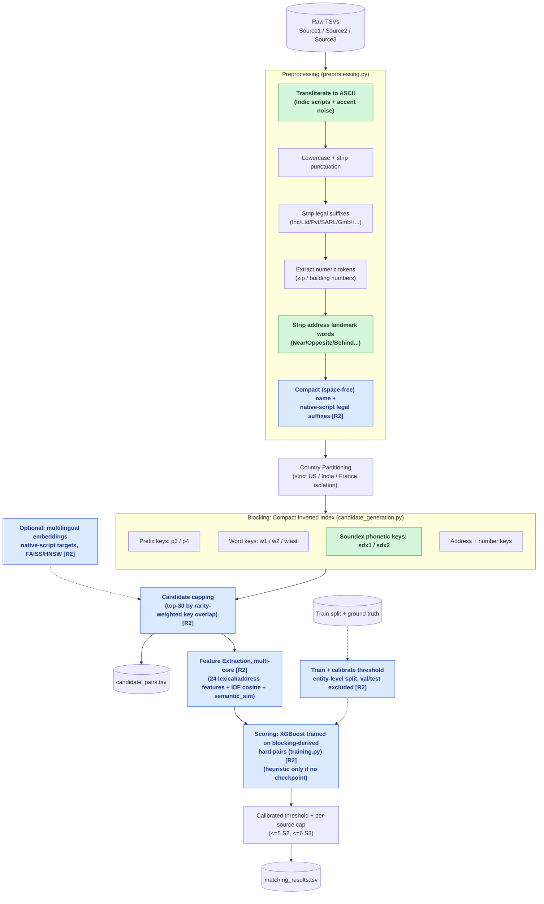
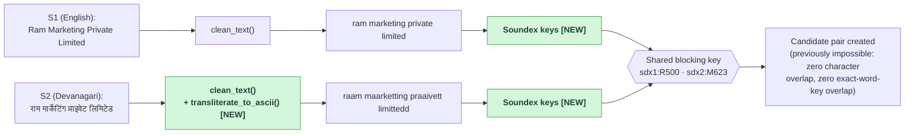
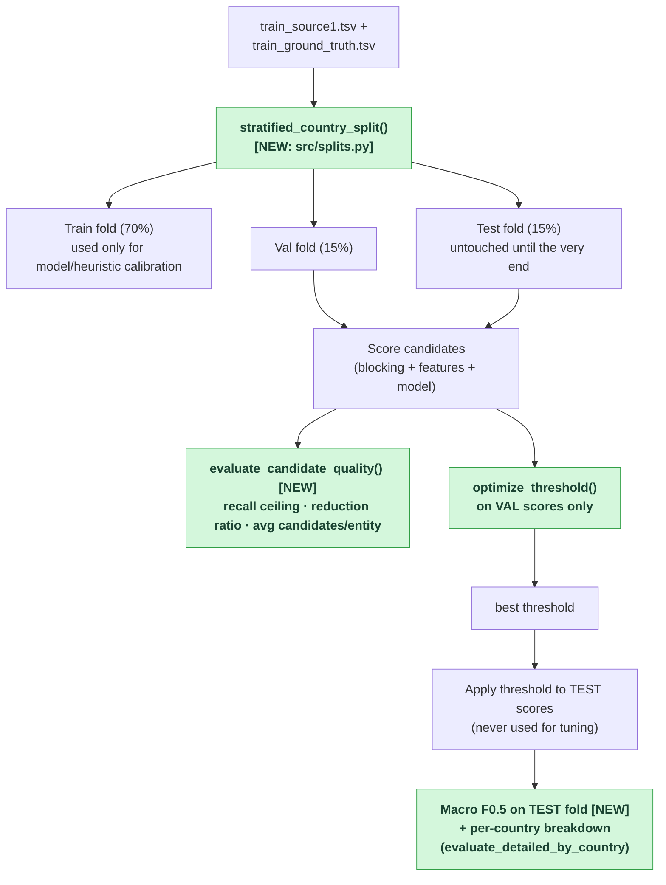

# Amazon ML Challenge 2026: Business Entity Resolution
### Team `aads`

A scalable, memory-efficient Machine Learning solution for Business Entity Resolution across noisy, independent catalog sources (Source 1 reference against Source 2 and Source 3 target pools).

Designed to process $> 11$ million multi-country records within **32 GB RAM** on an AWS SageMaker `ml.m5.2xlarge` instance without triggering the Linux OOM killer.

**Contents:** [How It Works](#how-it-works-plain-english) · [Architecture & Data Flow](#architecture--data-flow) · [Semantic Matching](#semantic-matching-embeddings) · [Key Highlights](#key-highlights--innovations) · [Roadmap](#roadmap-hardening-against-real-dataset-findings) · [Directory Structure](#directory-structure) · [Dataset Setup](#dataset-setup) · [Quickstart](#quickstart) · [Docker](#docker) · [Output Format](#output-format)

---

## How It Works (Plain English)

The task: for every business in **Source 1** (a clean, deduplicated reference list), find every record in **Source 2** and **Source 3** (two large, messy target pools) that describes the *same real-world business* — even though the three sources never share an ID, and names/addresses are full of typos, abbreviations, missing pieces, and — as we found by actually reading the data — different alphabets entirely (see [Roadmap #1](#roadmap-hardening-against-real-dataset-findings)).

The scoring metric (Macro F0.5) punishes a wrong match *twice as hard* as a missed one, and rewards correctly saying "no match" at full credit. So the whole pipeline is built around **precision first, recall second**:

1. **Clean & normalize** every name/address the same way, regardless of source (`preprocessing.py`) — lowercase, strip punctuation, expand abbreviations, remove legal suffixes (`Pvt Ltd`, `LLC`, `SARL`...), and — since real data forced this — transliterate non-Latin scripts and strip accent noise before anything else runs.
2. **Never compare across countries.** The ground truth shows 0% of matches cross a country boundary, so blocking and scoring are strictly partitioned by country — this alone rules out the vast majority of impossible pairs before any real comparison work happens.
3. **Block, don't brute-force** (`candidate_generation.py`). Comparing every Source 1 record against every Source 2/3 record is billions of comparisons — instead, an inverted index maps cheap "keys" (name prefixes, significant words, phonetic codes, address numbers) to the records that share them, so each Source 1 entity only ever gets compared against a short list of plausible candidates.
4. **Score each candidate pair** on 17 similarity features (`features.py`) — name similarity (several algorithms, on both the full name and the legal-suffix-stripped "core" name), structural signals (shared tokens, length ratios), and address similarity (word overlap, character overlap, matching numbers).
5. **Decide with a threshold, then cap per source** (`model.py`, `pipeline.py`). A candidate becomes a match only above a tuned score threshold, and even then at most 5 Source 2 matches + 6 Source 3 matches survive per entity — that specific 5/6 split come from measuring the real ground-truth cardinality distribution, not a guess.
6. **Stream results to disk** in batches, so memory use stays flat regardless of how many millions of records are being processed.

Everything below this point is either the detailed technical view of that same pipeline (diagrams), or a running log of specific bugs we found by reading the *actual* competition data and what we did about each one (roadmap table).

---

## Architecture & Data Flow

### End-to-end pipeline (green = round 1 additions, blue = round 2 [R2], see below)



### What the cross-script fix actually does, on a real row pair

This is the literal S1 (English) vs. S2 (Devanagari) pair pulled from `train_source2.tsv`, run through the *actual* edited code:



Before this fix, `w1:ram` vs. `w1:raam` and every prefix/exact key differed by spelling, so this pair never became a candidate at all — it was invisible to blocking, not just weakly scored.

### Evaluation harness: why the old 0.88–0.99 range wasn't trustworthy



Previously, the threshold sweep and the reported F0.5 both ran against the *same* set of S1 entities (or whatever `--subset` happened to be that run) — so the number was always at least a little optimistic, and small subsets skewed further toward 1.0 because macro F0.5 rewards correctly-predicted singletons at full credit. Now the reported number comes from a fold the threshold search never saw.

---

## Round 2: Why the real score was 0.6–0.7, and what changed

The real SageMaker score (0.616, later 0.6–0.7) sat far below the ~0.88 local estimate. Reading the code and sampling real ground-truth pairs turned up concrete causes — each is fixed on branch `feat/trained-classifier-multicore`. **None of these fixes has been measured on the real dataset yet** (it can't be run on the 16GB dev laptop); the numbers to expect come from your next SageMaker run, so treat the table as "what was wrong and what was done", not as a score claim.

| # | What was actually wrong | Evidence | Fix |
|---|---|---|---|
| A | **Test-time runs never used a trained model.** Only `entity_model_old_v1.json` (labelled "Overfit/Biased") existed; the default run silently fell back to the hand-weighted heuristic at a guessed threshold of 0.62. Worse, when it *did* try to train at inference time it used the in-memory **test** frames, which contain none of the training ground-truth IDs — so it trained on nothing. | `pipeline.py::train_or_load_model` (old) | Training now loads the train split explicitly; a trained model + its calibrated threshold (`models/entity_model_calibration.json`) are what inference uses. |
| B | **Training pairs didn't look like inference pairs.** Negatives were random target rows (trivially dissimilar); a model trained that way learns "is this pair remotely similar?" and floods the output with false positives against real near-misses — exactly what F0.5 punishes 2×. Train/val were also split by *pair*, so one entity's pairs sat on both sides. | old `train_or_load_model` | New `src/training.py` + `src/country_pipeline.py`: pairs come from the **same blocking and feature code inference uses**, labelled from ground truth; split by S1 *entity*; threshold tuned against real entity-level macro F0.5. |
| C | **The "held-out" score wasn't held out.** The training sample was drawn from all S1 rows, which could include the val/test entities. | `main()` order of operations | Val/test folds are carved out first and excluded from training. |
| D | **The heuristic gave names 65% of the weight, but many real matches agree on address and not on name.** Sampled real ground-truth pairs: `Randle, Mock and Marini Spacsphere Inc` ↔ `Xylosol` (same address), `Hudson Mines Co` ↔ `Hudson Co Services`. Other noise seen: truncated names (`WINTERS MUNICIPALS OF`), address typos (`10ND AVENUE`), glued domain-style names (`wilfordhancock.com`), a legal suffix as a *prefix* (`LLC Moncada…`). | direct `grep` of real rows | 7 new features (`addr_token_set`, `addr_ratio`, `addr_missing`, `street_num_match`, `name_compact_ratio/partial`, `name_prefix_match`) so a trained model can learn "different name, same address" and "truncated name"; optional IDF-weighted cosine (`name_idf_cos`, `addr_idf_cos`) so common words (`pizza`, `road`, `services`) stop inflating similarity. |
| E | **Native-script legal suffixes survived stripping.** `प्राइवेट लिमिटेड` transliterates to `praaivett limittedd`, which never matched the suffix list, so it stayed inside the "core" name. | `text_unidecode` output for Hindi/Gujarati/Telugu/Kannada/Bengali/Tamil | Those transliterated forms are now in the suffix list. |
| F | **Candidate ranking was slow and crude.** Ranking used `Counter.update()` over numpy scalars (the slowest step) and raw key-overlap counts, so a hit on a 9,000-record generic key counted the same as a hit on a 3-record rare key when choosing which 30 candidates survive the cap. | `candidate_generation.py` | Vectorized, and each key is weighted by rarity (`1/log2(posting size + 2)`), which directly raises the recall ceiling under the same cap. |

### Multi-core
Previously almost everything ran on one core. Now (`--n_jobs`, default = every visible CPU):

| Stage | How it uses cores |
|---|---|
| 5 name + 2 address fuzzy scorers (the hot loop) | RapidFuzz `process.cpdist(..., workers=N)` — its own C++ thread pool, no Python loop, no pickling |
| Per-pair token/structure features | fork-based process pool (`src/parallel.py`), created *before* the big dataframes/torch/xgboost exist (forking afterwards is slow and can hang) |
| Text cleaning of 12M+ rows | same process pool, chunked |
| XGBoost training/inference | `n_jobs` set explicitly |
| Embedding model | `torch.set_num_threads`, `faiss.omp_set_num_threads` |

Verified on synthetic data: the parallel and serial feature paths give identical values (200k pairs, 0.73s vs 1.92s on this 10-core laptop with 3 workers — the real speed-up depends on the SageMaker instance's core count). **In Docker, the container sees the host's CPUs unless you cap it with `--cpus`.**

### What is verified vs. not
- ✅ Run end-to-end on a synthetic dataset (train + validate + inference + load-checkpoint paths) with a stand-in for XGBoost, since the real one can't import on the dev Mac. That checks the plumbing (splits, exclusion, calibration save/load, output format), **not** accuracy — the synthetic data is trivially easy.
- ✅ Unit-level checks: parallel == serial features, vectorized capping matches expected output (and does 3M pairs in ~0.4s), embedding-candidate path with a fake encoder.
- ❌ Not measured: real F0.5, real recall ceiling, real training time, real memory at full scale. **0.98 is not something this branch claims** — run `--is_train --validate` and read the printed test-fold number and per-country breakdown; that, not this README, is the answer.

---

## Semantic Matching (Embeddings) — optional

A supplement, **not** the main scoring engine (the trained classifier carries the score). Cross-script matching is already attacked lexically by transliteration + Soundex; an embedding model can catch what those miss.

**Models** (`--embedding_model`, license/size/language facts read from each model's Hugging Face page; all far under the competition's 8B-parameter limit, used as-is):

| Preset | Model | License | Size / dim | Languages | Notes |
|---|---|---|---|---|---|
| `labse` **(default)** | [`sentence-transformers/LaBSE`](https://huggingface.co/sentence-transformers/LaBSE) | Apache-2.0 | ~0.5B / 768 | 109, incl. Hindi, Bengali, Tamil, Telugu, Kannada, Malayalam, Gujarati, Marathi, Punjabi, Oriya | Trained to align translations of the same text across languages (Feng et al., 2020) — the closest fit to "same name, different script". BERT-base compute. |
| `bge-m3` | [`BAAI/bge-m3`](https://huggingface.co/BAAI/bge-m3) | MIT | 1024-dim | 100+ | Strongest general multilingual model here, but a much larger network → noticeably slower on CPU. Try if LaBSE under-performs. |
| `minilm` | [`sentence-transformers/paraphrase-multilingual-MiniLM-L12-v2`](https://huggingface.co/sentence-transformers/paraphrase-multilingual-MiniLM-L12-v2) | Apache-2.0 | ~118M / 384 | 50+ | Fastest; weakest Indic coverage. |

**Which is best for business names on this data has not been measured** — run `--validate` with each and compare the test-fold F0.5 (per-country) before committing to one. Not used: `multilingual-e5-*` (needs `query: ` prefixes on every input; its authors note degraded quality for low-resource languages). `Graphlet-AI/eridu`, used in an earlier iteration, could not be loaded on SageMaker. Retrieval uses [FAISS](https://github.com/facebookresearch/faiss) (`faiss-cpu`, MIT) — exact search for small pools, HNSW above 200k vectors.

**Offline instances:** if SageMaker can't reach huggingface.co, save the model once where you can and pass the folder, e.g. `--embedding_model models/hf/labse` (one-liner in the `src/embeddings.py` docstring). A local directory is loaded with no network check.

**Cost control (`--embed_countries`, default `india`):** encoding is the most expensive step. Only **native-script targets** are encoded (Latin-script targets are already handled lexically), and only for the listed countries. Pairs whose target wasn't encoded get `semantic_sim = NaN` (XGBoost's "missing"), not a fake 0. Encoding time at real scale is **still unmeasured** — try `--subset` first.

**Wiring:** `--use_embeddings` adds each query's `--emb_top_k` nearest semantic neighbours to the lexical candidates (deduped) and a `semantic_sim` feature. If a model was trained with embeddings, run inference with the same flag (a mismatch is warned about, and the missing feature is NaN-filled instead of crashing).

---

## Key Highlights & Innovations

1. **Compact Inverted Indexing (`np.uint32`)**:
   Stores candidate index posting lists as 32-bit unsigned integer arrays, reducing memory by over $85\%$ compared to string objects or dense matrices.
2. **High-Frequency Key Pruning**:
   Keys indexing $> 10,000$ target records (generic business stop words and common tokens) are pruned to prevent $O(N \times M)$ quadratic candidate blowups.
3. **$S1$ Batch Chunking**:
   Slices Source 1 into batches (e.g. 50,000 rows). Candidate generation, feature extraction, and model scoring execute per chunk followed by immediate `gc.collect()`.
4. **Candidate Capping**:
   Limits maximum candidates to 30 per $S1$ query record, prioritizing candidates by blocking key overlap counts.
5. **Vectorized Feature Extraction**:
   Uses direct integer array indexing with RapidFuzz for high-speed similarity calculation ($> 500\text{k}$ pairs/sec) without DataFrame merge overhead.
6. **XGBoost Classifier + Fast Heuristic Fallback**:
   Trained on ground truth positive and negative pairs to maximize macro-averaged $F_{0.5}$. Checkpoint is only 359 KB ($< 8\text{B}$ parameter constraint).
7. **Streaming TSV Output**:
   Flushes predictions incrementally to disk (`output/matching_results.tsv`), adhering strictly to the competition format.
8. **Cross-Script Transliteration + Phonetic Blocking** *(new)*:
   Converts native-script business names/addresses (Devanagari, Tamil, Telugu, Kannada, Gujarati, Bengali, Malayalam, Oriya, Gurmukhi) and accented-Latin noise to ASCII before matching, plus a Soundex phonetic blocking key so transliteration spelling variants (`private` vs. `praaivett`) still collide into the same candidate block.

---

## Roadmap: Hardening Against Real Dataset Findings

The items below come from actually reading the real `student_resource/dataset` files (not assumptions) — row counts, script/character surveys, and manual verification of each fix against real rows before merging.

| # | Issue found in real data | Status | Notes |
|---|---|---|---|
| 1 | **~40% of India's Source 2/3 pool is written in native script** (Devanagari, Tamil, Telugu, Kannada, Gujarati, Bengali, Malayalam, Oriya, Gurmukhi) while Source 1 is ~100% Latin-script — these records were previously invisible to both blocking and scoring | ✅ **Done** | `preprocessing.py` now transliterates to ASCII before cleaning; `candidate_generation.py` adds a Soundex phonetic blocking key so transliterated spelling variants still land in the same candidate block. Verified against real rows (see diagram above). |
| 2 | **~7% of US names have injected accent noise** (`Nétwork` → should be `Network`) that was never normalized (`unicodedata` was imported but unused) | ✅ **Done** | Fixed by the same transliteration step as #1 — verified on the actual noisy rows. |
| 3 | **France (test-only country) has real French accents** (`Président`) that broke suffix-stripping (`societe` never matched `société`) | ✅ **Done** | Same transliteration step handles this too — verified on the actual test-set row. |
| 4 | **Real file sizes are much larger than the docs assumed** (train alone is Source1 2.2M + Source2 5.0M + Source3 5.3M ≈ 12.5M rows; test is a similar size again) — current code loaded Source2+Source3 fully into memory with several duplicated derived text columns living far longer than needed | 🔶 Partially addressed | Three changes, each individually verified at small/measurable scale (full verification needs a real SageMaker run — the actual dataset can't be loaded on the 16GB machine this was developed on): **(a)** `country_clean` is now `pd.Categorical` instead of plain strings — measured on a 100k-row proxy at the real countries' proportions, this column alone drops ~60x (a straight-line extrapolation puts the full ~12.5M-row column at ~757MB→~13MB, though that's an estimate, not a measured full run). **(b)** The per-country target-pool text arrays (`t_clean`/`t_norm`/`t_stripped`/`t_addrs_clean`/`t_addrs_norm`/`t_nums`) previously stayed alive as loose Python lists for that country's *entire* processing, duplicating `df_target_proc`'s own copy — now freed immediately after being consumed, in both `pipeline.py`'s main loop and `_run_scoring_pipeline` (this already matched `optimize_submission.py`'s existing, better practice — pipeline.py was the inconsistent one). **(c)** New `src/memlog.py` prints real peak-RSS at each checkpoint (after loading, after each country's index build, every 5 batches), so the *next* SageMaker run produces actual measured numbers instead of more static estimates. |
| 5 | Threshold defaults disagreed across `pipeline.py` (0.80) and `optimize_submission.py` (0.62) | ✅ **Done** | Both now default to `0.62` with an explicit CLI help-text note that it's a placeholder, not a verified optimum — the real value has to come from actually running `--validate` (see #6) on SageMaker, which this environment can't do at full scale. |
| 6 | F0.5 was tuned **and** reported on the same data (no held-out split) — the 0.88–0.99 range seen so far was never a trustworthy, reproducible number | ✅ **Done** | New `src/splits.py`: stratified (by country) train/val/test split. `pipeline.py --validate` now tunes the threshold on the **val** fold only and reports Macro F0.5 on the **test** fold, which the tuning step never sees, plus a per-country breakdown (`evaluate_detailed_by_country`) so a France-specific regression can't hide behind US/India volume. Verified on a small real 3,000-row sample (zero overlap between folds, country ratios preserved, perfect-prediction sanity check = 1.0) — a full run still needs to happen on SageMaker. |
| 7 | No trained XGBoost checkpoint exists; every run currently falls back to the hand-weighted heuristic scorer | 🔶 **Implemented, unrun** | `src/training.py` trains on blocking-derived pairs and saves model + calibrated threshold (see [Round 2](#round-2-why-the-real-score-was-0607-and-what-changed) A–C). Needs one real SageMaker `--is_train --validate` run to actually produce the checkpoint and the real score. |
| 8 | `candidate_pairs.tsv` size/recall-ceiling was never measured, even though the competition grades it separately from the leaderboard score | ✅ **Done** | New `evaluate_candidate_quality()` in `evaluate.py`: reports avg/median candidates per entity, total candidate pairs, and **recall ceiling** (the fraction of true matches that actually survive into the candidate set, regardless of score) — wired into `pipeline.py --validate`'s output. |
| 9 | Training sample for calibration used the first 50k S1 rows — no guarantee the raw file isn't grouped by country | ✅ **Done** | New `stratified_sample()` in `src/splits.py`, wired into both `pipeline.py::train_or_load_model` and `optimize_submission.py --train`. Verified on a deliberately US-heavy-first real slice (2000 US then 500 India rows): the old `df.iloc[:200]` gave **100% US, 0% India**; the new sampler gives **160:40 (4:1)**, matching the true population ratio. |
| 10 | Address "landmark" filler words (`Near`, `Opposite`, `Behind`, ...) weren't filtered out of address blocking/features | ✅ **Done** | Verified real frequency first (`near` in ~5.5% of India addresses, `opposite` in ~3.4%, plus `behind`/`beside`/`backside`/`above`/`below`/`front`/`infront`/`landmark`). New `ADDRESS_LANDMARK_WORDS` + `strip_landmark_words()` in `preprocessing.py`, applied to `business_address_norm` (fixes `features.py`'s address similarity) and directly inside `candidate_generation.py::extract_keys` (fixes blocking's `aw1`/`aw2` keys). Verified on a real address: blocking's `aw1` key shifted from the near-useless `near` to the actually-specific `1106` (a building number). |

**Status: 8/10 done, 2 need a real SageMaker run.** #4 needs one to confirm the estimated memory savings hold at full scale; #7 is implemented but has never produced a real checkpoint — neither can be verified on a 16GB laptop against a ~24M-row dataset.

---

## Directory Structure
```
AmazonMLC/
├── README.md                                          # Project root documentation
├── Dockerfile                                         # Portable runtime image (see Docker section)
├── .dockerignore                                      # Keeps dataset/output/models out of the build context
├── optimize_submission.py                             # Standalone post-processing / rescoring script
├── models/
│   └── entity_model.json                              # Trained XGBoost model checkpoint (mounted, not baked in)
├── aads_submission/
│   ├── Documentation_template.md                      # Official challenge documentation
│   └── business_entity_resolution/
│       └── code/
│           ├── README.md                              # Code guide
│           ├── requirements.txt                       # Python dependencies (torch: install the CPU wheel, see file)
│           └── src/
│               ├── candidate_generation.py            # Memory-compact inverted index & batching
│               ├── blocking.py                        # Backward-compatibility alias
│               ├── features.py                        # Vectorized pairwise similarity features
│               ├── model.py                           # XGBoost classification & scoring
│               ├── preprocessing.py                   # Text normalization, transliteration & token extraction
│               ├── evaluate.py                        # Macro F_0.5, candidate-quality & per-country evaluation
│               ├── splits.py                          # Stratified train/val/test split for honest evaluation
│               ├── memlog.py                          # Peak-RSS logging checkpoints
│               ├── embeddings.py                      # Optional multilingual-embedding candidates + semantic_sim
│               ├── parallel.py                        # Process pool + native thread config (multi-core)
│               ├── country_pipeline.py                # Shared per-country blocking/TF-IDF/embedding/feature builder
│               ├── training.py                        # Hard-pair training, entity-level split, threshold calibration
│               └── pipeline.py                        # Orchestration: train/load, validate, inference
└── student_resource/                                  # Fetched separately -- see Dataset Setup
    └── dataset/                                       # Competition datasets
```

---

## Dataset Setup

The competition dataset isn't in this repo (it's gitignored — see `student_resource/` in `.gitignore`) and needs to be fetched separately before anything else here will run:

```bash
curl -L -o student_resource.zip https://cdn.unstop.com/files/6ab10eb3b23ba_student_resource.zip
unzip student_resource.zip -d .
```

This is the official challenge archive and unpacks to `student_resource/`, containing `dataset/train/`, `dataset/test/`, the official `utils/validate_submission.py` format-checker, and the problem's own `Documentation_template.md`/`README.md`. Real sizes to expect (used throughout this README, not estimates): `train_source1.tsv` ≈ 2.2M rows, `train_source2.tsv` ≈ 5.0M rows, `train_source3.tsv` ≈ 5.3M rows, and the test split is a similar size again — budget disk and download time accordingly (each of the four largest files is roughly 1-1.5GB uncompressed).

---

## Quickstart

### 1. Install Dependencies
Inside a virtualenv (nothing is installed globally):
```bash
python3 -m venv .venv && source .venv/bin/activate
# CPU-only torch first (a plain `pip install torch` pulls the multi-GB CUDA build):
pip install torch==2.3.1 --index-url https://download.pytorch.org/whl/cpu
pip install -r aads_submission/business_entity_resolution/code/requirements.txt
```
`torch`/`sentence-transformers`/`faiss-cpu` are only exercised with `--use_embeddings`; skip the torch line and the three packages if you don't need it.

### 2. Train, calibrate, and measure the real held-out score (do this first)
```bash
export PYTHONPATH=aads_submission/business_entity_resolution/code
python3 -m src.pipeline \
    --data_dir student_resource/dataset \
    --is_train --validate
```
Trains XGBoost on blocking-derived hard pairs (`--train_sample`, default 80k S1 entities), saves `models/entity_model.json` + `models/entity_model_calibration.json`, then scores the held-out val/test folds and prints the **test-fold Macro F0.5**, the recall ceiling, and a per-country breakdown. Uses every CPU by default (`--n_jobs N` to cap).

### 3. Run inference on the test split
```bash
python3 -m src.pipeline \
    --data_dir student_resource/dataset \
    --matching_out output/matching_results.tsv \
    --candidate_out output/candidate_pairs.tsv
```
Loads the trained model and its calibrated threshold automatically (an explicit `--threshold` overrides it). If no checkpoint exists it trains one first from `data_dir/train`.

With embeddings (optional; use the same flag for training and inference):
```bash
python3 -m src.pipeline --data_dir student_resource/dataset --is_train --validate --use_embeddings
```

### 4. Fast Verification Run (Subset)
```bash
python3 -m src.pipeline --data_dir student_resource/dataset --is_train --validate --subset 20000 --train_sample 10000
```
Also prints `[mem] peak RSS so far` checkpoints (see `src/memlog.py`) — worth watching on the first real SageMaker run to confirm the memory estimates in the [Roadmap](#roadmap-hardening-against-real-dataset-findings) (#4).

---

## Docker

A `Dockerfile` at the repo root packages the whole pipeline into one portable image — build once, run anywhere (a laptop, EC2, or a SageMaker Studio terminal, which can run plain `docker build`/`docker run` directly since it's just a Linux host with Docker available). No SageMaker SDK, no extra services — just the container plus your local `student_resource/`, `output/`, and `models/` folders mounted in. Not build-tested in this environment (no Docker available here) — verified by careful review instead, so build it once yourself before relying on it.

### Build
```bash
docker build -t aads-entity-resolution .
```

### 1. Train + validate (writes the model and calibrated threshold into `./models`)
```bash
docker run --rm \
    -v "$(pwd)/student_resource/dataset:/data" \
    -v "$(pwd)/output:/output" \
    -v "$(pwd)/models:/models" \
    aads-entity-resolution --data_dir /data --model_path /models/entity_model.json --is_train --validate
```

### 2. Inference (the image's default command)
```bash
docker run --rm \
    -v "$(pwd)/student_resource/dataset:/data" \
    -v "$(pwd)/output:/output" \
    -v "$(pwd)/models:/models" \
    aads-entity-resolution
```
Produces `output/matching_results.tsv` + `output/candidate_pairs.tsv`, using the model and `entity_model_calibration.json` from `./models`. Any flags you append after the image name **replace** the default command, so repeat `--data_dir`, `--model_path`, etc. (as in step 1).

### Cores and memory
The container sees all of the host's CPUs by default, and the pipeline uses them all (`--n_jobs 0`). To cap it: `docker run --cpus 8 ... aads-entity-resolution ... --n_jobs 8` (pass both — `--cpus` limits the container, `--n_jobs` sizes the worker pools; a mismatch just oversubscribes).

### Embeddings in Docker
Add `--use_embeddings` to both commands. The model downloads into `/models/hf` (`HF_HOME`), i.e. into your mounted `./models` folder, once. On an instance with no internet, put a pre-downloaded copy at `./models/hf/labse` and add `--embedding_model /models/hf/labse`. The image installs the **CPU** PyTorch wheel; it does not use a GPU.

---

## Output Format
Predictions are written to `output/matching_results.tsv`:
```tsv
source1_entity_id	matched_entity_ids
S1-156285671	S2-611995673,S2-522132855
S1-717749279	
S1-913506265	S3-867068018
```
Singletons are represented as empty strings after the tab.
